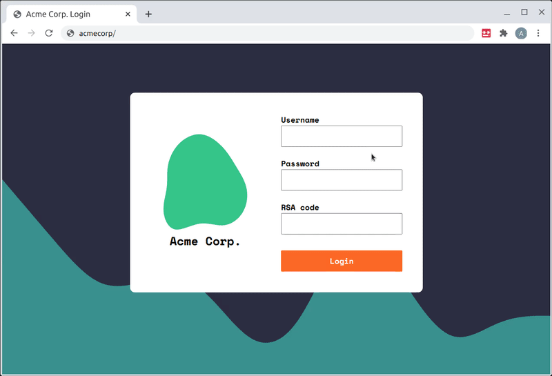

# 🔢 RSA SecurID Browser Extension [(install here)](https://chrome.google.com/webstore/detail/rsa-securid-code-generato/bdkphnndaejdmmbohpejmlfejfdbepap)

Welcome to the RSA SecurID Browser Extension, an easy-to-use tool for generating RSA SecurID token codes right in your browser. Please note that this is an unofficial hobby project and is not affiliated with or endorsed by RSA Security. Use it at your own risk.

Found a bug, or have an idea for an improvement? [Raise an issue](https://github.com/domdomegg/rsa-securid-browser-extension/issues).

## ✨ Example Usage

Here's an example of how to use the RSA SecurID Browser Extension to log in:
1.	Install the extension from the Chrome Web Store for automatic installation. If you prefer manual installation, follow the steps provided below.
2.	After installation, generate an Android token using the RSA Self Service Portal. Follow the prompts to set a memorable PIN and scan the generated token using a QR code scanning app.
3.	Copy the generated token URL (e.g., http://127.0.0.1/securid/ctf?ctfData=AwAA...) and paste it into the extension by clicking on the extension icon next to the address bar.
4.	If needed, you can reset the extension by accessing the options (right-click the extension icon and select 'Options').

## 🎉 Automatic install

Install this extension from the [Chrome Web Store](https://chrome.google.com/webstore/detail/rsa-securid-code-generato/bdkphnndaejdmmbohpejmlfejfdbepap).

## 👷 Manual install

1. Clone this repository to your local machine.
2. Open Google Chrome and navigate to `chrome://extensions`.
3. Enable `Developer mode` by toggling the switch in the top-right corner.
4. Click on `Load unpacked` and select the cloned folder to load the extension.

## 🔧 Setup
Before using the extension, ensure you have generated an Android token as described below. Follow the instructions provided by the RSA Self Service Portal to generate the token and obtain its URL.
1. Generate an Android token. This can be done via the RSA Self Service Portal:
    - Click 'Request Token'
    - Choose 'Software Token' then 'Android'
    - Set the PIN to something memorable, and submit it
    - Choose 'Scan Token Now' (the QR code option)
    - Use a QR code scanning app (e.g. [Google Lens](https://play.google.com/store/apps/details?id=com.google.ar.lens) or [Apple Camera](https://support.apple.com/en-gb/HT208843))
    - Your token should look like `http://127.0.0.1/securid/ctf?ctfData=AwAA...`
2. Click the extension icon (to the right of the address bar) and paste in the token

If you need to reset the extension, you can do this in the options (right click the extension icon, then 'Options')

## 💻 Usage

Once the extension is installed and configured:
1.	Click on the extension icon located to the right of the address bar.
2.	Enter your PIN when prompted.
3.	Click on the generated code to copy it to your clipboard for use in authentication processes.

## 🚀 Contributing
We welcome contributions from developers of all skill levels. If you have found a bug or have an idea for improvement, please raise an issue on GitHub.
To contribute to the extension's codebase:
1.	Fork the repository.
2.	Make your changes.
3.	Submit a pull request detailing your changes and improvements.

Please ensure that your contributions align with our project's goals and guidelines.
For more information on developing browser extensions, refer to the relevant documentation online. We aim to keep our documentation concise and informative, linking to external resources where applicable.
Happy coding!🎉

